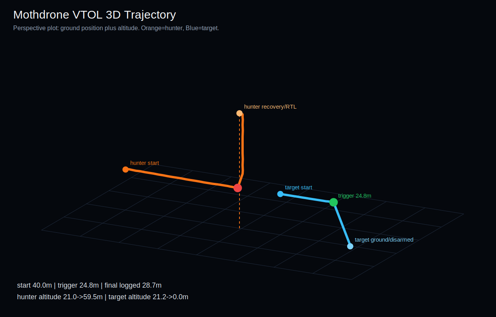
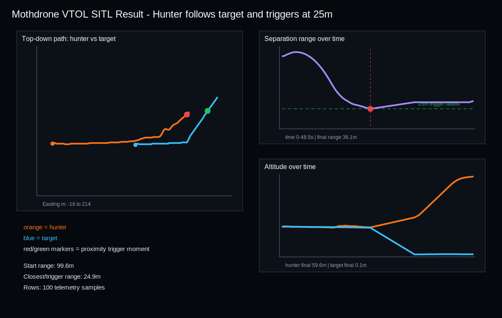

# PX4 Sim Starter

Starter workspace for PX4 SITL, Gazebo, ROS 2, and multi-vehicle simulation examples.

The repository now includes a complete two-VTOL Mothdrone SITL package with:

- PX4/Gazebo standard VTOL launch
- two-airframe hunter + target control
- full offboard takeoff
- target-first arm sync
- moving target offboard path
- hunter guidance toward target telemetry
- 25 m proximity trigger
- SITL-only target motor-stop/kill event
- hunter-only breakaway and RTL
- telemetry logging
- static and live 3D trajectory visualisation

## Repository Layout

| Path | Purpose |
| --- | --- |
| `PX4/` | PX4 setup notes |
| `Gazebo/` | Gazebo/GZ setup notes |
| `ROS2Humbel/` | ROS 2 Humble notes |
| `Mothdrone_Interception_SITL/` | Full two-VTOL SITL demo package |

## Mothdrone Interception SITL

Go to:

```bash
cd Mothdrone_Interception_SITL
```

Main files:

| File | Purpose |
| --- | --- |
| `launch_mothdrone.py` | Starts two PX4 standard VTOL SITL vehicles and runs mission |
| `code/mothdrone_controller.py` | Target-first arm sync, both-offboard takeoff, moving target path, hunter guidance, trigger, target kill, hunter RTL |
| `code/live_trajectory_server.py` | Live browser 3D trajectory graph |
| `outputs/graphs/mothdrone_trajectory_3d.svg` | Static 3D trajectory image |
| `outputs/graphs/mothdrone_mission_graph.svg` | Path/range/altitude graph |
| `outputs/test_reports/latest.md` | Latest verification report |
| `docs/GUIDANCE_STATE_MACHINE.md` | State machine and control logic |

### Latest Verified Result

From the included telemetry:

- start range: `99.9 m`
- trigger range: `25.0 m`
- target path: `E=100.0 -> 155.2 m`, `N=0.0 -> 10.6 m`
- target after trigger: SITL kill accepted, altitude logged at `0.0 m`
- hunter after trigger: climbed from `21.5 m` to `59.6 m`
- recovery: target did not RTL; hunter alone performed breakaway/RTL

### Latest Graphs





### Run SITL

Prerequisites:

- PX4-Autopilot built at `~/PX4-Autopilot`
- Gazebo Sim configured for PX4
- Python with `mavsdk`
- Optional: QGroundControl

Run:

```bash
cd Mothdrone_Interception_SITL
python3 -m pip install -r requirements.txt
python3 launch_mothdrone.py
```

On the original tested macOS machine:

```bash
/Users/sanju/.venvs/mothdrone/bin/python launch_mothdrone.py
```

### Live 3D Trajectory

Start this before or during SITL:

```bash
cd Mothdrone_Interception_SITL
python3 code/live_trajectory_server.py
```

Open:

```text
http://127.0.0.1:8790/live_trajectory.html
```

The page refreshes from `mothdrone_telemetry.json` every 0.5 s. The controller writes telemetry during flight.

## Safety Boundary

The Mothdrone target motor-stop behavior is simulation-only. It is guarded in the launcher by:

```text
MOTHDRONE_SITL_TARGET_KILL=1
```

Do not use this as a real-aircraft motor-stop path.
